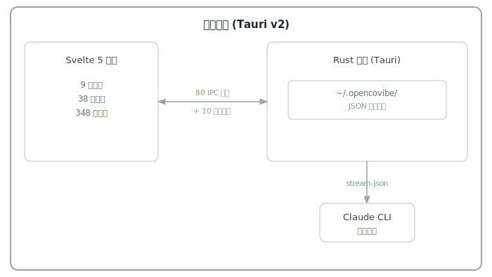

<p align="center">
  
</p>

<p align="center">
  <strong>本地优先的 AI 辅助编程桌面应用</strong>
</p>

<p align="center">
  <a href="#为什么选择-opencovibe">为什么</a> &middot;
  <a href="#核心能力">核心能力</a> &middot;
  <a href="#快速开始">快速开始</a> &middot;
  <a href="#支持的平台">平台</a> &middot;
  <a href="#架构">架构</a> &middot;
  <a href="#许可证">许可证</a>
</p>

<p align="center">
  <a href="README.md">English</a> | <b>简体中文</b>
</p>

---

<p align="center">
  
</p>

## 为什么选择 OpenCovibe？

Claude Code 等 AI 编程 CLI 功能强大，但它们运行在终端里。这意味着没有持久化的面板、没有可视化的 Diff 审查、没有跨会话历史、也无法自由切换多个 API 平台。OpenCovibe 用原生桌面 UI 包装这些 CLI，补上终端无法提供的那些能力层 —— 同时保持所有数据**本地存储**。（调用远程模型 API 需要联网；应用本身没有云端后台。）

| Agent | 状态 |
|-------|------|
| [Claude Code](https://github.com/anthropics/claude-code) | 已适配 |
| [Codex](https://github.com/openai/codex) | 适配中 |

**平台状态**：目前主要在 **macOS** 上开发和测试。Windows 和 Linux 可以构建运行，但尚未进行充分的兼容性调整和测试，欢迎提交问题报告和贡献。

**核心原则**：封装 CLI，可视化工作，数据本地化。

## 核心能力

### CLI 不提供、OpenCovibe 补上的

| 能力 | OpenCovibe 增加了什么 |
|------|----------------------|
| **可视化工具卡片** | 每个工具调用（Read、Edit、Bash、Grep、Write、WebFetch……）都渲染为内联卡片，带语法高亮 Diff、结构化输出和一键复制 |
| **运行历史与回放** | 浏览所有历史会话，完整事件回放，从任意节点恢复 / 分叉 |
| **多平台热切换** | 用 Claude Code 接入 15+ API 平台（DeepSeek、Kimi、智谱、百炼、豆包、MiniMax、OpenRouter、Ollama……），无需重启即可切换 |
| **Agent 管理** | 可视化编辑器创建、编辑、管理自定义 Agent 定义（.md 文件），支持表单模式和源码模式 |
| **用量分析** | 按模型的 Token 分解、成本追踪、每日热力图、会话级统计 |
| **团队面板** | 只读查看 Claude Code 多 Agent 团队协作 —— 任务列表、队友状态、消息流 |
| **活动监控** | 实时 Hook 事件流、工具活动时间线、嵌套工具卡片的子 Agent 追踪 |
| **插件市场** | 可视化浏览、安装、管理 Claude Code 插件和技能 |
| **MCP 管理** | 发现 MCP 服务器、查看逐服务器状态、一键重连 / 启停 |
| **内联权限审查** | 丰富的权限审查 UI，带允许/拒绝按钮、CLI 建议的"始终允许"规则、AskUserQuestion 渲染 |

### 更多功能

- **富文本聊天 UI** — Markdown、语法高亮、思考块、图片附件、文件 Diff、可折叠工具分组
- **会话控制** — 创建、恢复、分叉、重命名会话；计划模式切换；模型热切换
- **内联斜杠命令** — `/model`、`/diff`、`/todos`、`/tasks`、`/doctor`、`/copy`、`/stats` 等——在应用内原生渲染
- **快捷键** — 完全可自定义的键绑定，支持组合键和冲突检测
- **国际化** — 轻量响应式运行时，支持英文和简体中文
- **系统托盘** — 最小化到托盘；后台会话持续运行，支持原生通知
- **深色 / 浅色主题** — 基于 CSS 变量的主题系统
- **安装向导** — 首次启动引导 CLI 检测、认证和平台配置

## 快速开始

### 方式 A：下载预编译包（macOS）

从 [Releases](https://github.com/AnyiWang/OpenCovibe/releases) 下载最新 `.dmg` —— 通用二进制，同时支持 Apple Silicon 和 Intel Mac。

> **注意**：应用未经代码签名。首次启动时，右键点击应用选择"打开"以绕过 macOS Gatekeeper。

### 方式 B：自动安装（macOS）

```bash
git clone https://github.com/AnyiWang/OpenCovibe.git
cd OpenCovibe
./scripts/setup.sh          # 加 --yes 跳过确认提示
npm run tauri dev
```

安装脚本自动检测并安装缺少的依赖（Xcode CLI Tools、Homebrew、Node.js、Rust）。

### 方式 C：手动安装

**前置条件：**

- [Node.js](https://nodejs.org/) >= 20
- [Rust](https://rustup.rs/) >= 1.75

**macOS：**
```bash
xcode-select --install
brew install node
curl --proto '=https' --tlsv1.2 -sSf https://sh.rustup.rs | sh
```

**Linux (Debian/Ubuntu)：**
```bash
sudo apt install libwebkit2gtk-4.1-dev build-essential curl wget file \
  libxdo-dev libssl-dev libayatana-appindicator3-dev librsvg2-dev
curl --proto '=https' --tlsv1.2 -sSf https://sh.rustup.rs | sh
```

**Windows：**
```powershell
# 从 https://rustup.rs 安装 Rust
# 从 https://nodejs.org 安装 Node.js
```

**构建与运行：**

```bash
git clone https://github.com/AnyiWang/OpenCovibe.git
cd OpenCovibe
npm install
npm run tauri dev
```

### 安装向导

首次启动时，OpenCovibe 会引导你完成：

1. **CLI 检测** — 自动检测 Claude Code CLI，未安装则提供安装引导
2. **认证** — OAuth 登录或 API Key，支持 15+ 平台
3. **就绪** — 开始编程

你可以随时从**设置 > 通用 > 安装向导**重新运行。

## 支持的平台

### LLM 厂商

| 厂商 | 端点 | 认证方式 |
|------|------|---------|
| Anthropic | 官方 API | API Key |
| DeepSeek | `api.deepseek.com/anthropic` | API Key |
| Kimi（月之暗面） | `api.moonshot.cn/anthropic` | Bearer |
| Kimi For Coding | `api.kimi.com/coding/` | API Key |
| 智谱 | `open.bigmodel.cn/api/anthropic` | API Key |
| 百炼（阿里云） | `dashscope.aliyuncs.com/apps/anthropic` | Bearer |
| 豆包（字节跳动） | `ark.cn-beijing.volces.com/api/coding` | API Key |
| MiniMax | `api.minimax.io/anthropic` | API Key |
| MiniMax（中国） | `api.minimaxi.com/anthropic` | API Key |
| 小米 MiMo | `api.xiaomimimo.com/anthropic` | API Key |

### API 代理

| 平台 | 端点 | 认证方式 |
|------|------|---------|
| Vercel AI Gateway | `ai-gateway.vercel.sh` | Bearer |
| OpenRouter | `openrouter.ai/api` | Bearer |
| AiHubMix | `aihubmix.com` | API Key |

### 本地

| 平台 | 端点 |
|------|------|
| Ollama | `localhost:11434` |
| 自定义 | 任何 Anthropic 兼容端点 |

## 架构

<p align="center">
  
</p>

**技术栈：**

| 层级 | 技术 |
|------|------|
| 框架 | [Tauri v2](https://v2.tauri.app/)（Rust 后端 + WebView） |
| 前端 | [Svelte 5](https://svelte.dev/) + [SvelteKit](https://svelte.dev/docs/kit/)（adapter-static） |
| 样式 | [Tailwind CSS](https://tailwindcss.com/) v3 + CSS 变量 |
| 终端 | [xterm.js](https://xtermjs.org/) |
| Markdown | [marked](https://marked.js.org/) + [highlight.js](https://highlightjs.org/) + [DOMPurify](https://github.com/cure53/DOMPurify) |
| 国际化 | 轻量自建运行时 (en + zh-CN) |
| 测试 | [Vitest](https://vitest.dev/) |

**Agent 通信：**

应用通过双向 stream-JSON 协议（stdin/stdout）与 Claude Code CLI 通信。每个会话由独立的 session actor 管理，支持多轮长连接对话。支持四种通信模式：stream-JSON（主要）、PTY（交互式终端）、pipe（Codex）和直接 API（HTTP 流式）。

**数据存储：**

所有数据本地存储在 `~/.opencovibe/` —— 无云端，无数据库。

```
~/.opencovibe/
├── settings.json          # 用户设置
├── runs/                  # 会话历史
│   └── {run-id}/
│       ├── meta.json      # 运行元数据
│       ├── events.jsonl   # 事件日志
│       └── artifacts.json # 摘要
└── keybindings.json       # 自定义快捷键
```

## 开发

```bash
npm install              # 安装依赖
npm run tauri dev        # 热重载开发模式
npm test                 # 运行测试
npm run lint:fix         # 代码检查
npm run format           # 代码格式化
```

## 参与贡献

欢迎贡献！请通过 [Issue](https://github.com/AnyiWang/OpenCovibe/issues) 提交 Bug 报告或功能建议，也欢迎提交 Pull Request。

## 许可证

基于 [Apache License 2.0](LICENSE) 许可。

Copyright 2025-2026 OpenCovibe Contributors.
