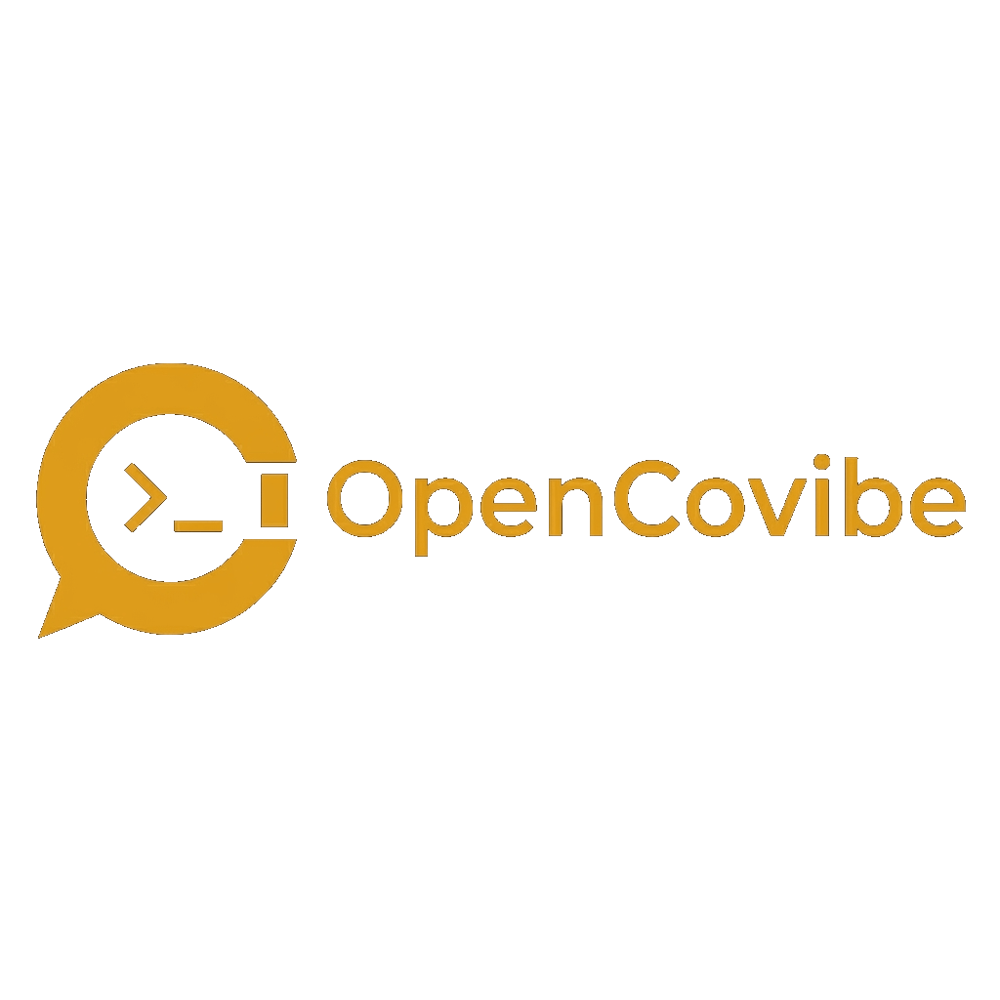
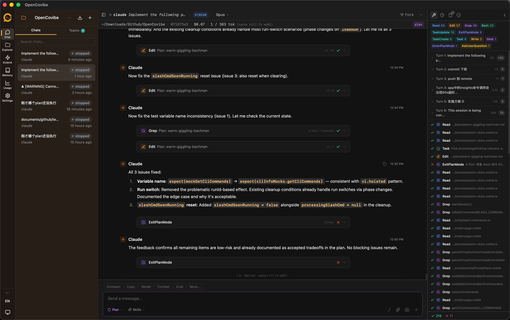
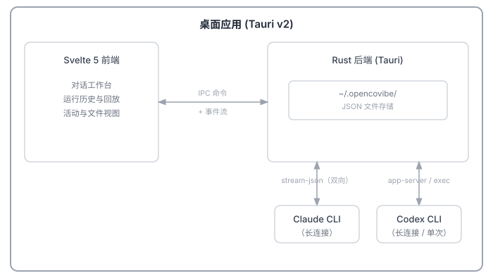

<p align="center">
  
</p>

<p align="center">
  <strong>本地优先的 AI 辅助编程桌面应用</strong>
</p>

<p align="center">
  <a href="#为什么选择-opencovibe">为什么</a> &middot;
  <a href="#核心能力">核心能力</a> &middot;
  <a href="#快速开始">快速开始</a> &middot;
  <a href="#支持的模型平台">模型平台</a> &middot;
  <a href="#架构">架构</a> &middot;
  <a href="#许可证">许可证</a>
</p>

<p align="center">
  <a href="README.md">English</a> | <b>简体中文</b>
</p>

---

<p align="center">
  
</p>

## 为什么选择 OpenCovibe？

Claude Code、Codex 等 AI 编程 CLI 功能强大，但以终端为中心的界面不易持续追踪长时间任务、可视化审查和跨会话管理。OpenCovibe 用原生桌面 UI 包装这些 CLI，提供持久化面板、结构化工具活动、可视化 Diff 和可搜索的运行历史，同时保持应用数据**本地存储**。调用远程模型 API 仍需要联网；OpenCovibe 本身没有云端后台。

| Agent                                                    | 状态                                                              |
| -------------------------------------------------------- | ----------------------------------------------------------------- |
| [Claude Code](https://github.com/anthropics/claude-code) | 已适配                                                            |
| [Codex](https://github.com/openai/codex)                 | 已适配 —— 实验性交互式 `app-server` 模式（默认），`exec` 作为回退 |

**平台状态**：提供 **macOS 13+**（Apple Silicon 和 Intel）与 **Windows 10+ x64** 预编译包；Linux 支持源码构建。目前仍主要在 macOS 上开发和测试，尤其欢迎 Windows 和 Linux 用户提交问题报告。

**核心原则**：封装 CLI，可视化工作，数据本地化。

## 核心能力

### OpenCovibe 增加的能力

| 能力               | OpenCovibe 增加了什么                                                                                            |
| ------------------ | ---------------------------------------------------------------------------------------------------------------- |
| **可视化工具卡片** | 每个工具调用（Read、Edit、Bash、Grep、Write、WebFetch……）都渲染为内联卡片，带语法高亮 Diff、结构化输出和一键复制 |
| **运行历史与回放** | 浏览所有历史会话，完整事件回放，从任意节点恢复 / 分叉，支持软删除和恢复                                          |
| **多平台热切换**   | 通过内置预设让 Claude Code 接入 Anthropic 兼容服务、API 网关和本地运行时，无需重启即可切换                       |
| **浏览器远程访问** | 带 Token 认证的内嵌 Web 服务器，支持局域网浏览器访问或通过 HTTP 隧道（ngrok / cloudflared）远程访问              |
| **文件浏览器**     | 浏览和编辑项目文件，支持语法高亮、Markdown 预览、图片预览和 Git Diff 查看                                        |
| **Memory 编辑器**  | 创建和编辑 CLAUDE.md、项目级和用户级 Memory 文件，支持实时预览                                                   |
| **Agent 管理**     | 可视化创建、编辑和管理 Claude Agent 定义与 Codex 角色，支持表单模式和源码模式                                    |
| **权限规则管理**   | 可视化管理 CLI 权限允许/拒绝规则，支持用户级和项目级配置                                                         |
| **用量分析**       | 按模型的 Token 分解、成本追踪、每日热力图、模型堆叠图表、会话级统计                                              |
| **团队面板**       | 只读查看 Claude Code 多 Agent 团队协作 —— 任务列表、队友状态、消息流                                             |
| **活动监控**       | 实时 Hook 事件流、工具活动时间线、文件追踪面板、嵌套工具卡片的子 Agent 追踪                                      |
| **插件市场**       | 可视化浏览、安装和管理 Claude Code、Codex 插件与技能                                                             |
| **MCP 管理**       | 发现 MCP 服务器、查看逐服务器状态、一键重连 / 启停                                                               |
| **内联权限审查**   | 丰富的权限审查 UI，批量允许/拒绝面板、CLI 建议的"始终允许"规则、AskUserQuestion 渲染                             |
| **CLI 会话导入**   | 发现、导入并同步已有的 Claude Code 和 Codex CLI 会话                                                             |
| **Rewind 回退**    | Claude：通过 dry-run 预览选择性恢复检查点文件；Codex：只回退对话历史，不恢复文件                                 |
| **远程主机**       | 配置 SSH 远程主机执行 CLI，支持密钥生成向导和连接测试                                                            |
| **预览与元素选取** | 在伴侣窗口中打开 localhost 预览，交互式选取页面元素，将结构化上下文（DOM 路径、样式、HTML 片段）插入对话         |
| **Ralph 循环**     | 在 Claude 会话中自动迭代同一提示直到满足完成条件，支持自定义最大迭代次数                                         |
| **系统诊断**       | CLI、平台、SSH 和代理配置的系统健康检查                                                                          |

### 更多功能

- **富文本聊天 UI** — Markdown、语法高亮、思考块、图片附件、文件 Diff、工具突发折叠分组
- **会话控制** — 创建、恢复、分叉、重命名会话；计划模式切换；模型热切换；上下文历史追踪
- **拖拽上传** — 原生文件拖拽，支持图片、PDF、目录和路径引用
- **项目文件夹** — 侧栏项目选择器，Memory、权限和会话按项目隔离
- **内联斜杠命令** — `/model`、`/diff`、`/todos`、`/tasks`、`/doctor`、`/copy`、`/stats`、`/preview`、`/ralph` 等——在应用内原生渲染
- **快捷键** — 完全可自定义的键绑定，支持组合键和冲突检测
- **Hook 管理** — 配置上游 CLI Hook，实现事件驱动自动化
- **国际化** — 轻量响应式运行时，支持英文和简体中文
- **系统托盘** — 最小化到托盘；后台会话持续运行，支持原生通知
- **深色 / 浅色主题** — 基于 CSS 变量的主题系统，支持 UI 缩放
- **更新检测** — 应用内检查新版本并提供对应平台的下载链接
- **安装向导** — 首次启动引导 CLI 检测、认证和平台配置

## 快速开始

### 方式 A：下载预编译包

从 [Releases](https://github.com/AnyiWang/OpenCovibe/releases) 下载最新安装包：

- **macOS 13+**：同时支持 Apple Silicon 和 Intel Mac 的通用 `.dmg`
- **Windows 10+ x64**：`.msi` 或安装程序 `.zip`

> **未签名构建**：macOS 首次启动时，请右键点击应用并选择**打开**；Windows SmartScreen 可能需要选择**更多信息 > 仍要运行**。

### 方式 B：自动安装（macOS / Linux）

```bash
git clone https://github.com/AnyiWang/OpenCovibe.git
cd OpenCovibe
./scripts/setup.sh          # 加 --yes 跳过确认提示
```

安装脚本会识别当前平台、检查必要构建工具，经确认后安装缺失依赖并安装项目包。在 macOS 上可配置 Xcode CLI Tools 和 Homebrew；在受支持的 Linux 发行版上会安装所需的 WebKit/GTK 软件包。脚本最后会询问是否立即启动开发应用；之后可使用 `npm run tauri dev` 启动。

### 方式 C：手动安装

**前置条件：**

- [Node.js](https://nodejs.org/) >= 20
- 当前稳定版 [Rust](https://rustup.rs/) 工具链
- [Git](https://git-scm.com/)

**macOS 13+：**

```bash
xcode-select --install
brew install node
curl --proto '=https' --tlsv1.2 -sSf https://sh.rustup.rs | sh
```

**Linux (Debian/Ubuntu)：**

```bash
sudo apt install libwebkit2gtk-4.1-dev build-essential curl wget file git \
  libgtk-3-dev libssl-dev pkg-config libayatana-appindicator3-dev librsvg2-dev
curl --proto '=https' --tlsv1.2 -sSf https://sh.rustup.rs | sh
```

**Windows 10+ x64：**

1. 安装 [Microsoft C++ Build Tools](https://visualstudio.microsoft.com/visual-cpp-build-tools/)，勾选 **Desktop development with C++**。
2. 如果系统尚未安装，请安装 [Microsoft Edge WebView2 Runtime](https://developer.microsoft.com/microsoft-edge/webview2/)。
3. 安装 Node.js 20+、Git，以及 [rustup](https://rustup.rs/) 提供的 Rust MSVC 工具链。

**构建与运行：**

```bash
git clone https://github.com/AnyiWang/OpenCovibe.git
cd OpenCovibe
npm install
npm run tauri dev
```

### 安装向导

首次启动时，OpenCovibe 会引导你完成：

1. **CLI 检测** — 自动检测 Claude Code 和 Codex CLI，未安装则提供安装引导
2. **认证** — 根据所选 Agent 使用 CLI 登录、OAuth 或平台 API Key
3. **就绪** — 开始编程

你可以随时从**设置 > 通用 > 安装向导**重新运行。

## 支持的模型平台

不同 Agent 的平台兼容性并不相同。运行时以**设置**页面显示的预设为准，具体列表可能随版本调整。

### Claude Code（Anthropic 兼容）

| 分类         | 内置预设                                                                                                                             |
| ------------ | ------------------------------------------------------------------------------------------------------------------------------------ |
| 官方         | Claude Code / Anthropic                                                                                                              |
| 模型服务商   | DeepSeek、Kimi、智谱、百炼、豆包、MiniMax、小米 MiMo、腾讯混元、硅基流动、阶跃星辰、LongCat、讯飞星辰、腾讯 Coding Plan              |
| API 网关     | Vercel AI Gateway、OpenRouter、AiHubMix、Requesty、Fireworks AI、DeepInfra、Novita AI、ZenMux                                        |
| 本地与路由器 | Ollama、[CC Switch](https://github.com/farion1231/cc-switch)、[Claude Code Router](https://github.com/musistudio/claude-code-router) |
| 自定义       | 任意 Anthropic 兼容端点                                                                                                              |

### Codex（OpenAI Responses API）

Codex 可以使用原生 ChatGPT/API Key 登录，也可以配置支持 Responses API 的 Vercel AI Gateway、AiHubMix、Requesty、Fireworks AI、ZenMux、Ollama 或自定义端点。仅提供 Chat Completions 的平台需要 Responses 转换代理，无法直接使用。

## 架构

<p align="center">
  
</p>

**技术栈：**

| 层级     | 技术                                                                                                                           |
| -------- | ------------------------------------------------------------------------------------------------------------------------------ |
| 框架     | [Tauri v2](https://v2.tauri.app/)（Rust 后端 + WebView）                                                                       |
| 前端     | [Svelte 5](https://svelte.dev/) + [SvelteKit](https://svelte.dev/docs/kit/)（adapter-static）                                  |
| 样式     | [Tailwind CSS](https://tailwindcss.com/) v3 + CSS 变量                                                                         |
| 终端     | [xterm.js](https://xtermjs.org/)                                                                                               |
| Markdown | [marked](https://marked.js.org/) + [highlight.js](https://highlightjs.org/) + [DOMPurify](https://github.com/cure53/DOMPurify) |
| 国际化   | 轻量自建运行时 (en + zh-CN)                                                                                                    |
| 测试     | [Vitest](https://vitest.dev/)                                                                                                  |

**Agent 通信：**

交互式会话由每个运行独立的 session actor 管理。**Claude Code** 使用长期运行的双向 stream-JSON 协议（stdin/stdout），并带有交互式控制协议。**Codex** 支持两种传输方式：实验性的 `codex app-server`（长期运行的双向 JSON-RPC —— **默认**，支持交互式审批、turn 中途 steer、fork/rewind/compact/goal、图片输入和实时命令输出）或 `codex exec`（每轮启动一次的一次性 NDJSON 进程——可在设置中选择的回退方案，适用于旧版或不兼容的 Codex CLI）。

**数据存储：**

OpenCovibe 自有状态本地存储在 `~/.opencovibe/`，不使用云端数据库。

```
~/.opencovibe/
├── settings.json          # 用户设置
├── runs/                  # 会话历史
│   └── {run-id}/
│       ├── meta.json      # 运行元数据
│       ├── events.jsonl   # 作为事实来源的事件日志
│       ├── artifacts.json # 派生的运行摘要
│       ├── attachments/   # 存在附件时保存消息附件
│       └── history-v1/    # 可重建的分页历史投影
├── prompt-favorites.json  # 收藏的提示词
└── *-index / *-cache      # 可重建的搜索索引和用量缓存
```

功能需要时，OpenCovibe 也会读取或更新 CLI 自有配置：Claude Code 数据位于 `~/.claude/`，Codex 数据位于 `~/.codex/`，项目级文件包括 `.claude/` 或 `AGENTS.md`。应用快捷键覆盖保存在 `~/.opencovibe/settings.json`；Claude CLI 快捷键仍位于 `~/.claude/keybindings.json`。

## 开发

```bash
npm install              # 安装依赖
npm run tauri dev        # 热重载开发模式
npm run verify           # 代码检查、格式检查、类型检查、测试、前端构建和 Rust 检查
npm test                 # 仅运行 Vitest 测试
npm run fix              # 自动修复前端 lint/格式并运行 cargo fmt
```

## 参与贡献

欢迎贡献！开发环境、代码规范和 PR 要求请参阅 [CONTRIBUTING.md](CONTRIBUTING.md)。你也可以通过 [Issue](https://github.com/AnyiWang/OpenCovibe/issues) 提交 Bug 报告或功能建议。

## Star History

[](https://star-history.com/#AnyiWang/OpenCovibe&Date)

## 许可证

基于 [Apache License 2.0](LICENSE) 许可。

Copyright 2025-2026 OpenCovibe Contributors.
